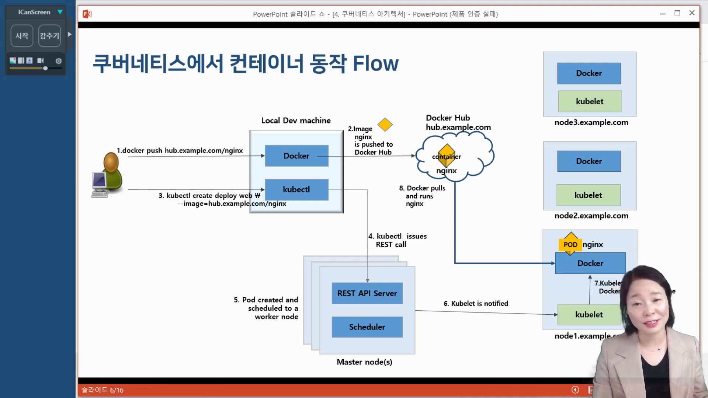

# CNI(Container Network Interface)

- Container간 통신을 지원하는 VxLAN, Pod Network이라고도 부름

- 다양한 종류의 플러그 인이 존재
  - 플라넷(카타코다), 칼리코, 위브넷


# 쿠버네티스 클러스터 구성

- control plane(master node)

  - 워커 노드들의 상태를 관리하고 제어

  - single master, multi master

    

- worker node
  - 도커 플랫폼을 통해 컨테이너를 동작하여 실제 서비스 제공


# 초기 쿠버네티스 설치하기

vm에 - master, node1,node2 직접 설치

1. 도커 설치
2. 쿠버네티스 설치
   1. 설치 전 환경설정
   2. kubeadm, kubectl, kubelet 설치
   3. control-plane 구성
   4. worker node 구성


# 쿠버네티스 동작 원리




# 쿠버네티스 아키텍쳐


- 컨포넌트
  - 마스터 컴포넌트
    - etcd : key-value 형태의 저장소 역할
    - kube-apiserver : api 역할
    - kube-scheduler : 파드를 실행할 노드 선택 역할
    - kube-controller-manager : 파드를 관찰하며 개수를 보장하는 역할 
  - 워커 노드 컴포넌트
    - kubelet :  데몬형태로 동작
    - kube-proxy
    - 컨테이너 런타임


# 쿠버네티스 네임스페이스

물러적인 클러스터 하나를 논리적으로 나누는것

통합 솔루션에서는 꼭 필요하다

```bash
kubectl get namespaces  # 현재 실행중인 네임스페이스 확인

#네임스페이스 만드는법 1.yaml파일 2.CLI
#1.yaml
kubectl create -f orange-ns.yaml
#2.CLI
kubectl create namespace blue
```

